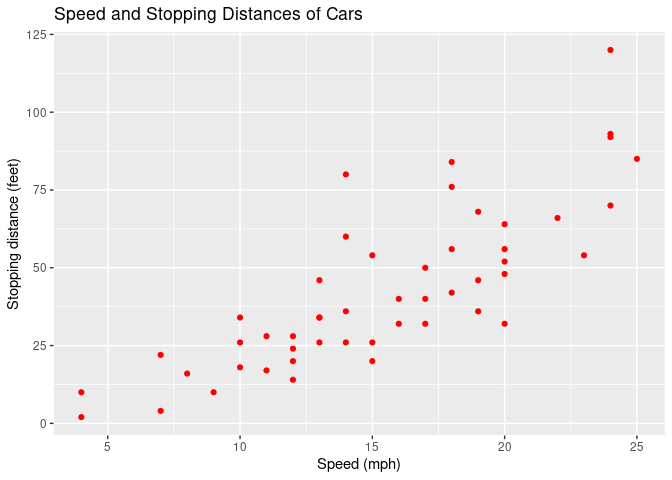
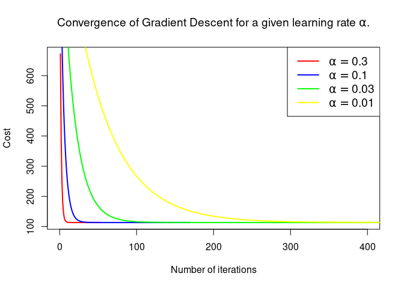
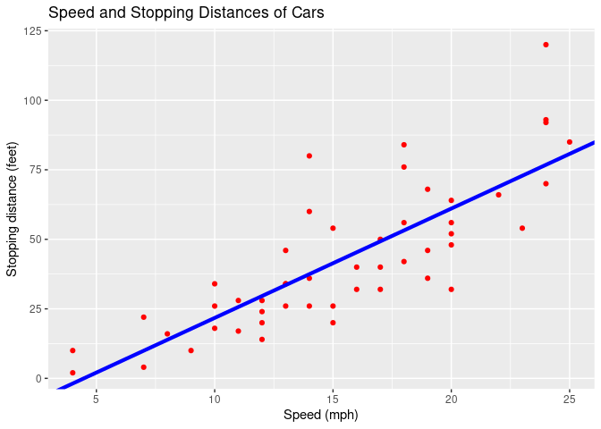

# $\huge{\textbf{Simple Linear Regression}}$

[https://julienatto.github.io/Linear_regression1/](https://julienatto.github.io/Linear_regression1/)


Simple linear regression is a statistical method for finding a linear relationship between an explanatory variable $X$ and a variable to be explained $y$:
\[y= \theta_0 + \theta_1 X.\]

# Data preparation and visualisation


The data **cars** in R package **datasets** give the speed of cars and the distances taken to stop, and  were recorded in the 1920s.

##  Visualization of 10 rows chosen randomly among the 50 observations

```
##    speed dist
## 28    16   40
## 16    13   26
## 22    14   60
## 37    19   46
## 44    22   66
## 9     10   34
## 5      8   16
## 38    19   68
## 49    24  120
## 4      7   22
```


## Graph


<!-- -->

# Linear regresson using Gradient Descent
## Computation of the parameters


```
## [1] "alpha= 0.3 : Convergence realized after 53  iterations."
## [1] "alpha= 0.1 : Convergence realized after 169  iterations."
## [1] "alpha= 0.03 : Convergence realized after 544  iterations."
## [1] "alpha= 0.01 : Convergence realized after 1538  iterations."
```


<!-- -->


If we choose $\alpha=0.01$, then we have:


\[\theta=\begin{pmatrix} -17.5790872\\3.9324077 \end{pmatrix}\]

## Plotting the linear fit


<!-- -->

## Predictions
* **Predict stopping distance for a speed of 21 mph**:


$\qquad\quad$For speed = 21 mph (33.8 km/h), we predict a stopping distance of  **65** feet (**19.81** m).

\
&nbsp;

* **Predict stopping distance for a  speed of 30 mph**:


$\qquad\quad$For speed = 30 mph (48.28 km/h), we predict a stopping distance of  **100.39** feet (**30.6** m).

# Simple Linear Regression using lm() function of R (Normal equation)

\[\theta=(X^TX)^{-1}X^Ty.\]


```
## 
## Call:
## lm(formula = dist ~ speed, data = cars)
## 
## Coefficients:
## (Intercept)        speed  
##     -17.579        3.932
```

We can see that the values of the fitted parameters are $\hat{\theta_0}=-17.579$ and $\hat{\theta_1}=3.932$.

## Summary of the model

```
## 
## Call:
## lm(formula = dist ~ speed, data = cars)
## 
## Residuals:
##     Min      1Q  Median      3Q     Max 
## -29.069  -9.525  -2.272   9.215  43.201 
## 
## Coefficients:
##             Estimate Std. Error t value Pr(>|t|)    
## (Intercept) -17.5791     6.7584  -2.601   0.0123 *  
## speed         3.9324     0.4155   9.464 1.49e-12 ***
## ---
## Signif. codes:  0 '***' 0.001 '**' 0.01 '*' 0.05 '.' 0.1 ' ' 1
## 
## Residual standard error: 15.38 on 48 degrees of freedom
## Multiple R-squared:  0.6511,	Adjusted R-squared:  0.6438 
## F-statistic: 89.57 on 1 and 48 DF,  p-value: 1.49e-12
```


## Predictions
* **Predict stopping distance for a speed of 21 mph**:


$\qquad\quad$For speed = 21 mph (33.8 km/h), we predict a stopping distance of  **65** feet (**19.81** m).

* **Predict stopping distance for a speed of 30 mph**:


$\qquad\quad$For speed = 30 mph (48.28 km/h), we predict a stopping distance of  **100.39** feet (**30.6** m).
