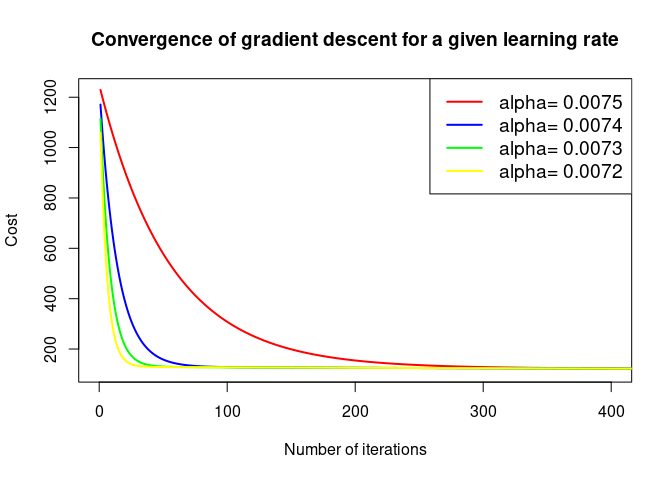
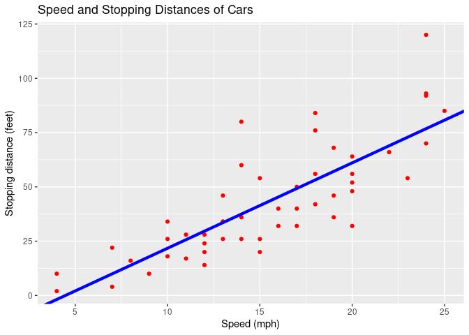

```r
#loading libraries to use
library(dplyr)
library(datasets) #for cars data
library(ggplot2)
```

Simple linear regression is a statistical method for finding a linear relationship between an explanatory variable $X$ and a variable to be explained $y$:
\[y= \theta_0 + \theta_1 X.\]

# I. Data preparation and visualisation

```r
#Loading car data

data(cars)
```

The data **cars** in R package **datasets** give the speed of cars and the distances taken to stop, and  were recorded in the 1920s.

## 1. Visualization of ten rows chosen randomly among the 50 observations

```r
set.seed(1234)
cars[sample(1:50,10),]
```

```
##    speed dist
## 28    16   40
## 16    13   26
## 22    14   60
## 37    19   46
## 44    22   66
## 9     10   34
## 5      8   16
## 38    19   68
## 49    24  120
## 4      7   22
```


## 2. Graph

```r
#% Plot Data
plt<-cars%>%
  ggplot(aes(x = speed, y = dist)) +
  geom_point(colour="red") +
  xlab("Speed (mph)") +
  ylab("Stopping distance (feet)") +
  ggtitle("Speed and Stopping Distances of Cars")


plt
```

<!-- -->

# II. Linear regresson using Gradient Descent
## 1. Computation of the parameters

```r
#X and y
X<-cars$speed
y=cars$dist

# initializing fitting parameters
theta = cbind(numeric(2)) 

# choosing number of iterations
nb_iter = 10000

#loading  some functions... 
source("functions.R")

##############################################################
  #Ploting cost as function of number of iterations for some values of the learning rate.
  # and choose theta related to the better learning rate. 
  #Here,it seems that good values of alpha are between 0.0075 and 0.007.
  ALPHA<-c(0.0075,0.0074,0.0073,0.0072)
  COL<-c("red","blue","green","yellow")
  out<-list()

  for(i in 1:length(ALPHA)){
    #% Initializing  theta and running Gradient Descent 
    theta = matrix(0,2)
    Grad_Desc<- Grad_Desc_fct(X, y, theta, alpha = ALPHA[i], nb_iter)
    theta<-Grad_Desc$theta
    Cost_by_iter<-Grad_Desc$Cost_by_iter
    out[[i]]<-theta
    #% Plot the convergence graph for different values of alpha
    curr_i=i
    if(curr_i==1){
      plot(1:nrow(Cost_by_iter), Cost_by_iter, type="l",lwd=2,xlab='Number of iterations',ylab='Cost',col=COL[1],
           main="Convergence of gradient descent for a given learning rate",xlim = c(0,400))
    }else{
      lines(1:nrow(Cost_by_iter), Cost_by_iter, type="l",lwd=2,col=COL[i])
    }
  }
  legend("topright", legend = paste("alpha=",ALPHA), 
         lwd = 2, cex = 1.2, col = COL, lty = rep(1,4))
```

<!-- -->


If we choose $\alpha=0.0075$, then we have:


\[\theta=\begin{pmatrix} -17.571407\\3.9319611 \end{pmatrix}\]

## 2. Plotting the linear fit

```r
#Plot the linear fit

plt+geom_abline(intercept = theta[1], slope = theta[2], color="blue", 
               size=1.5,)
```

<!-- -->

## 3. Predictions
### a. Predict stoping distance for a speed of 21 mph.

```r
dist_for_21 = c(c(1, 21)%*%theta)
```

For speed = 21 mph (33.8 km/h), we predict a stopping distance of  **65** feet (**19.81** m).

### b, Predict stoping distance for a  speed of 30 mph.

```r
dist_for_30 =c( c(1, 30)%*%theta)
```

For speed = 30 mph (48.28 km/h), we predict a stopping distance of  **100.39** feet (**30.6** m).

# III. Simple Linear Regression using lm() function of R (Normal equation)

\[\theta=(X^TX)^{-1}X^Ty.\]


```r
model_lm<-lm(dist~speed,data = cars)

model_lm
```

```
## 
## Call:
## lm(formula = dist ~ speed, data = cars)
## 
## Coefficients:
## (Intercept)        speed  
##     -17.579        3.932
```

We can see that the values of the fitted parameters are $\hat{\theta_0}=-17.579$ and $\hat{\theta_1}=3.932$.

## 1. Summary of the model

```r
summary(model_lm)
```

```
## 
## Call:
## lm(formula = dist ~ speed, data = cars)
## 
## Residuals:
##     Min      1Q  Median      3Q     Max 
## -29.069  -9.525  -2.272   9.215  43.201 
## 
## Coefficients:
##             Estimate Std. Error t value Pr(>|t|)    
## (Intercept) -17.5791     6.7584  -2.601   0.0123 *  
## speed         3.9324     0.4155   9.464 1.49e-12 ***
## ---
## Signif. codes:  0 '***' 0.001 '**' 0.01 '*' 0.05 '.' 0.1 ' ' 1
## 
## Residual standard error: 15.38 on 48 degrees of freedom
## Multiple R-squared:  0.6511,	Adjusted R-squared:  0.6438 
## F-statistic: 89.57 on 1 and 48 DF,  p-value: 1.49e-12
```


## 2. Predictions
### a. Predict stoping distance for a speed of 21 mph.

```r
dist_for_21_ =predict.lm(model_lm,data.frame(speed=21))
```

For speed = 21 mph (33.8 km/h), we predict a stopping distance of  **65** feet (**19.81** m).

### a. Predict stoping distance for a speed of 30 mph.

```r
dist_for_30_ =predict.lm(model_lm,data.frame(speed=30))
```

For speed = 30 mph (48.28 km/h), we predict a stopping distance of  **100.39** feet (**30.6** m).
